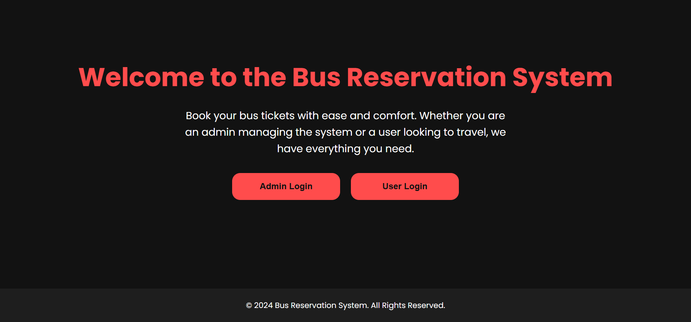
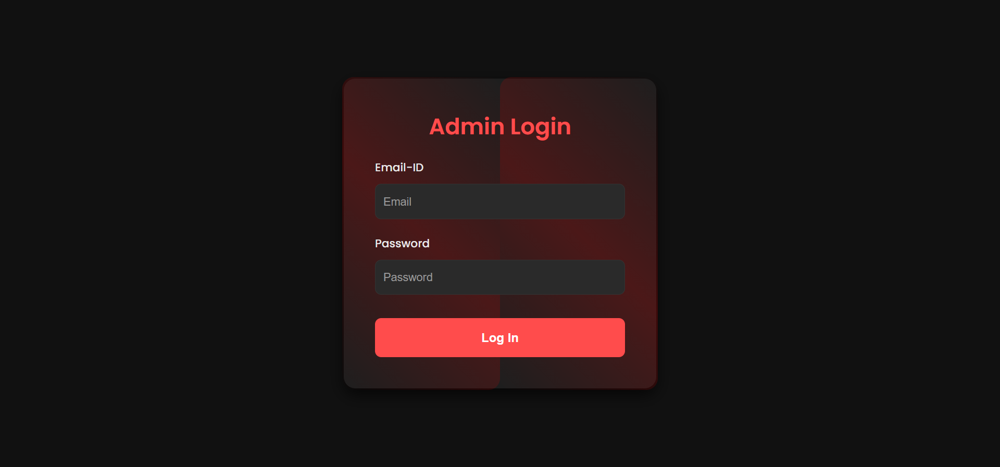
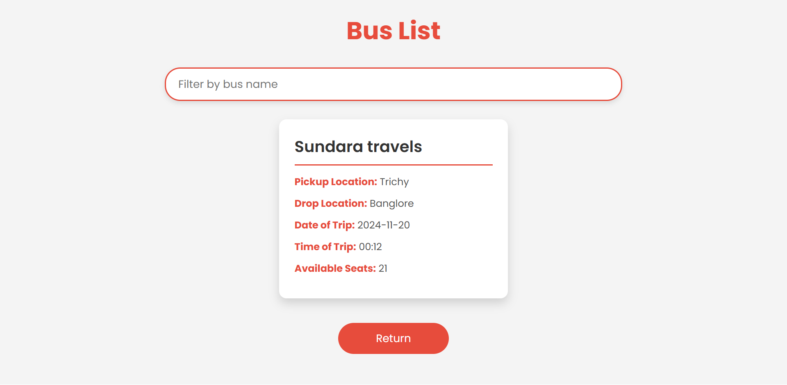
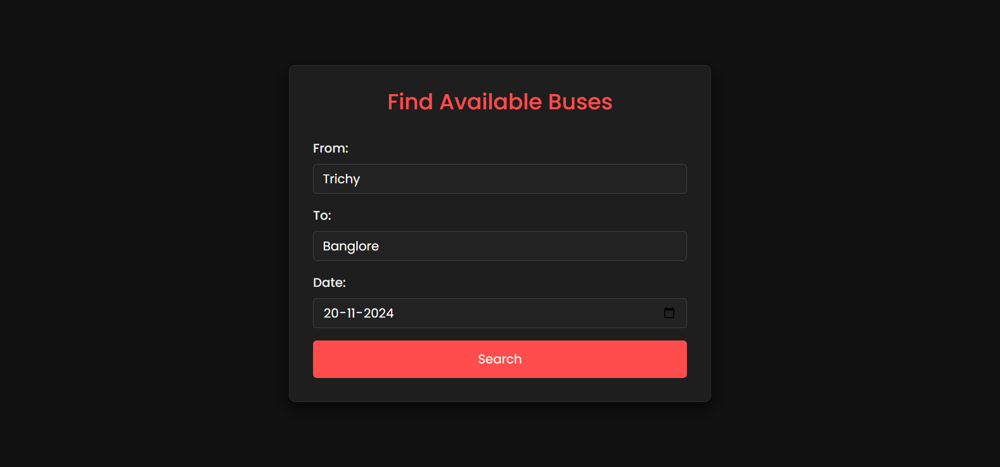
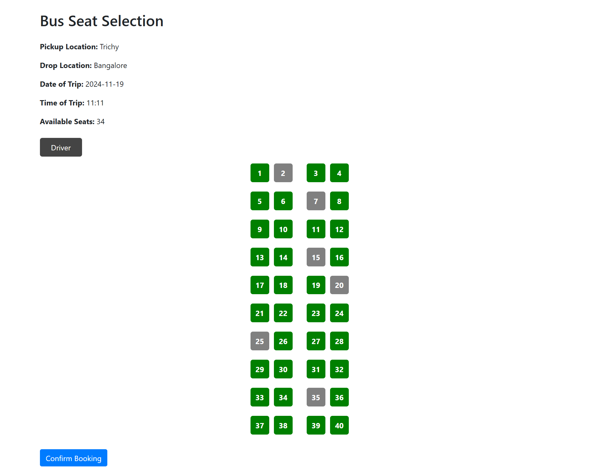

# 🚌 SwiftBus-A-Smart-Bus-Ticket-Reservation-System

SwiftBus is a web-based bus reservation system using Spring MVC, Hibernate, MySQL, JSP, and Maven. It allows users to search buses and book seats, while admins manage schedules. Built with an MVC structure, it offers secure, efficient ticket booking with a user-friendly interface.
---

## 📌 Features
- User and Admin login
- Search buses by location
- Book tickets with seat selection
- Admin panel to manage buses
- JSP-based frontend with form handling
- MVC architecture with service and DAO layers

---

## 🛠 Tech Stack
- Java 8+
- Spring MVC
- Hibernate (JPA)
- MySQL
- JSP & JSTL
- Apache Maven
- Eclipse IDE

---
## 🖼️ Screenshots

### 🔐 Main Page


### 🔐 Admin Login Page


### 🏠 Bus List


### 🔍 Bus Search


### 🎫 Seat Selection


## 🚀 How to Run

1. **Clone the Repository**
   ```bash
   git clone https://github.com/yourusername/bus-reservation-system.git
   cd bus-reservation-system
